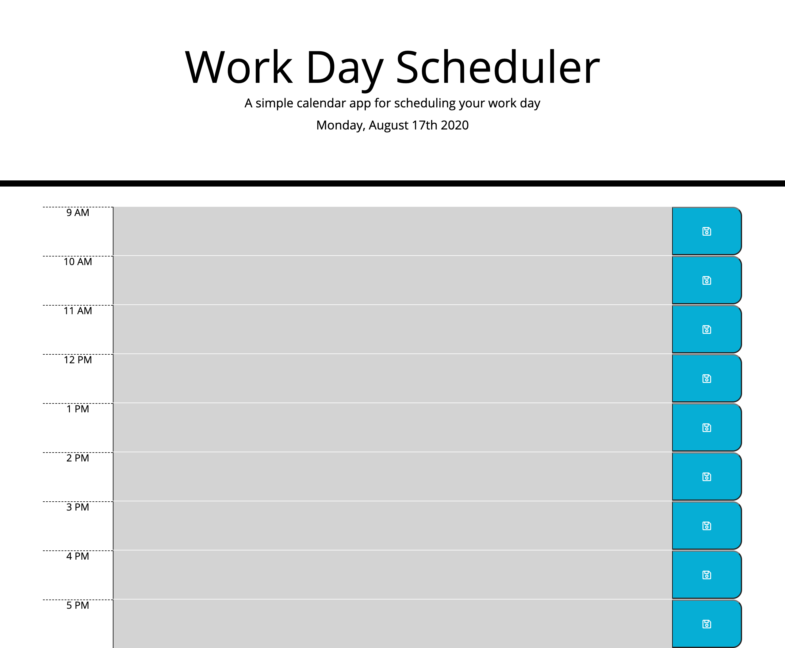

# Day Planner

This [day planner](https://aybaubau.github.io/dayPlanner/) keeps track of the date and and time, allows you to manage your to-dos in different time blocks. Todos are stored in local storage and persist afer refresh.

